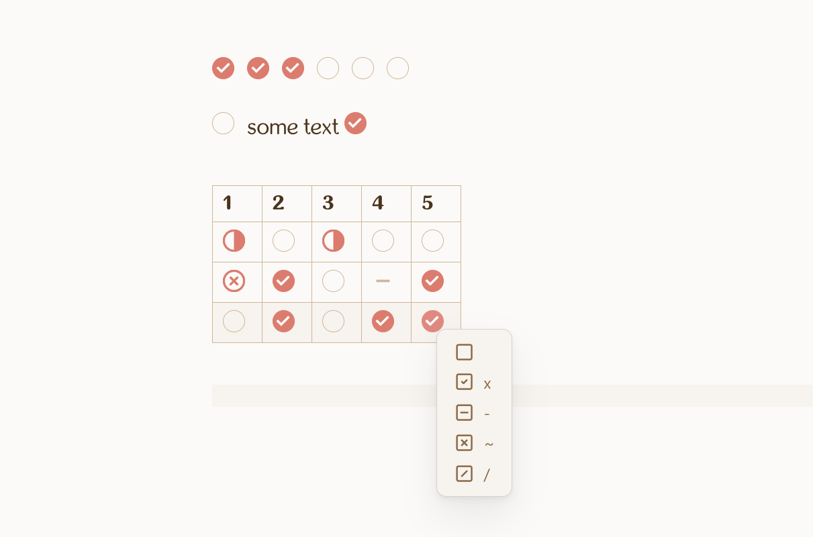

# HTML checkboxes

This plugin allows you to quickly add HTML checkboxes to your notes and makes them clickable. 

## Why use HTML checkboxes?

The main reason you may want to use HTML checkboxes instead of Markdown checkboxes is that you can put them into Markdown tables. You can also place them anywhere in the note, for example add several checkboxes in the row. Also all of your Markdown stays valid, and even if you turn the plugin off, all created checkboxes would still be visible (just not clickable).

## Details

To create checkbox you should put cursor to the place you want and call the command "Add HTML checkbox". Alternatively you can select the option in the editor menu. Be aware that every created checkbox has a unique id, it is nesessary for the checkboxes to be clickable. Do not remove the id and also do not copy-paste checkboxes inside the same file, because if there are several checkboxes with the same id, they will not work. It is recommended to never edit checkboxes manually. Also checkboxes are NOT added automatically on the next line when you hit "enter".

When right-clicking on the checkbox you will see the menu allowing you to select between a few of alternate checkboxes (you will need the theme or special css to make alternate checkboxes look different). Note that not all of possble alternate checkboxes are supported, and I am not planning to add more. When the alternate checkboxes menu appears inside the table it will hide the default table right-click menu. If you want to see table right-click menu, you should click on some other place in the cell.

Plugin works in embedded views as well, but clicking on checkboxes may cause some blinking in canvas.
